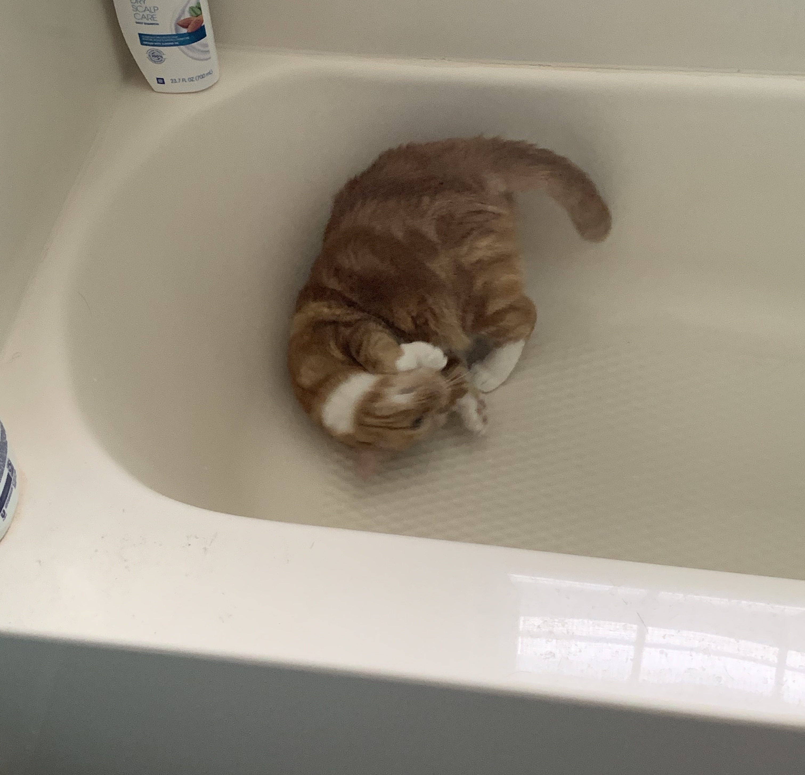
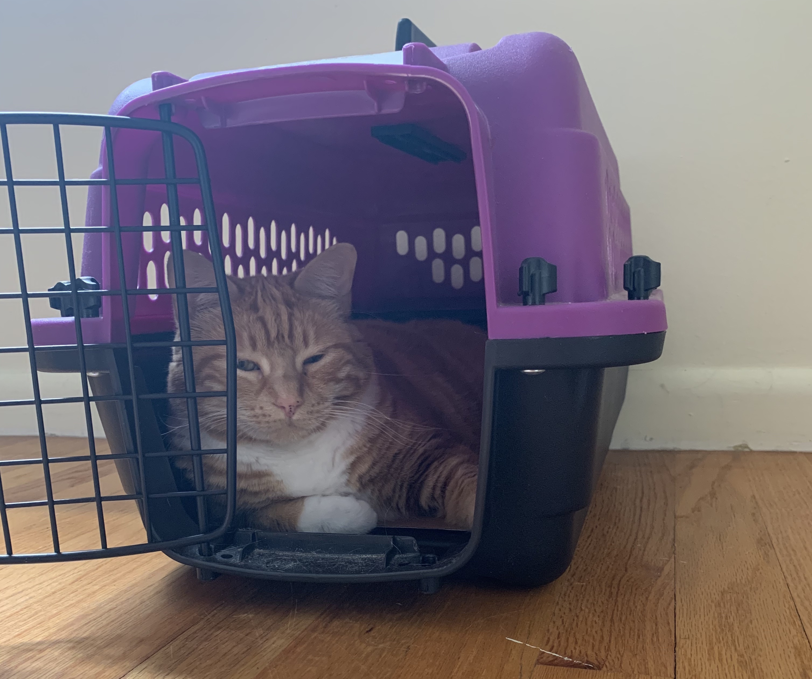
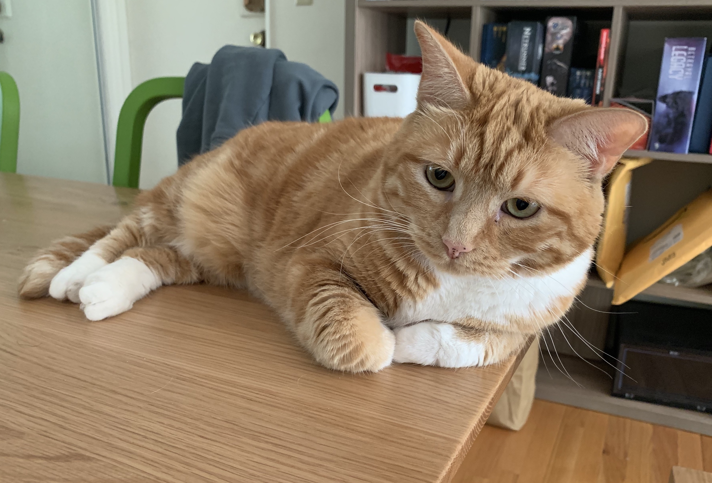
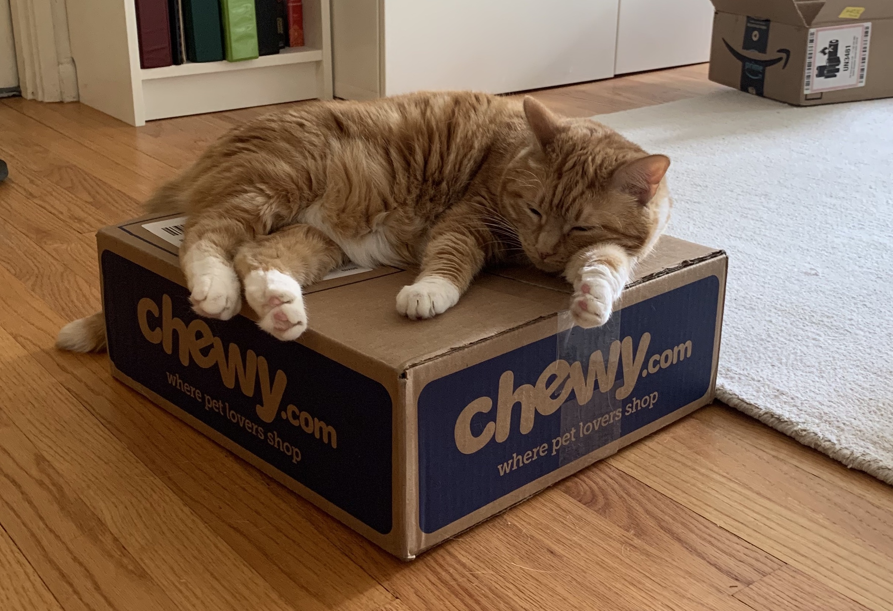
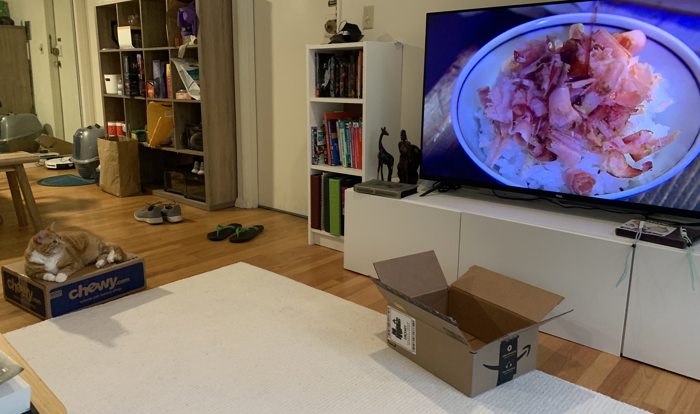
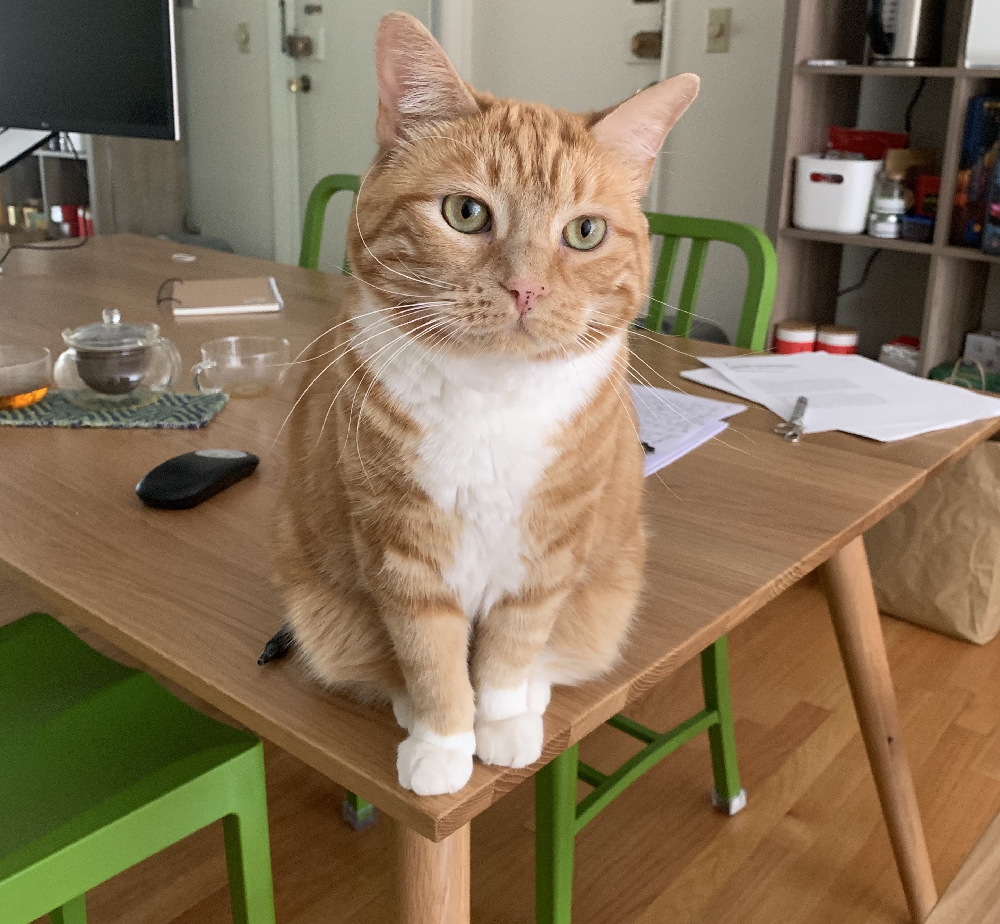
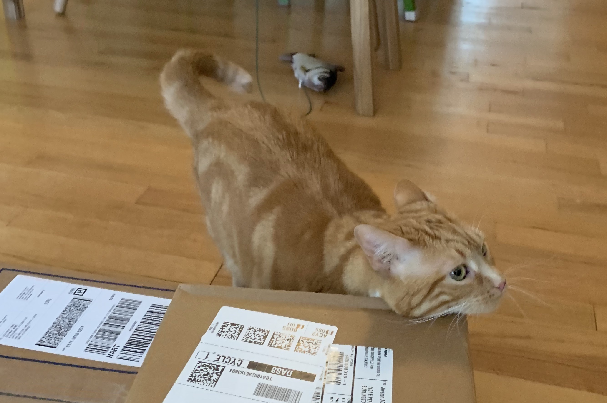
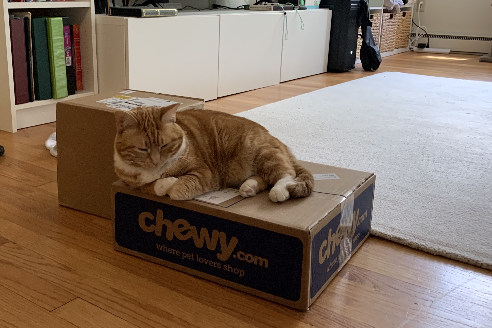
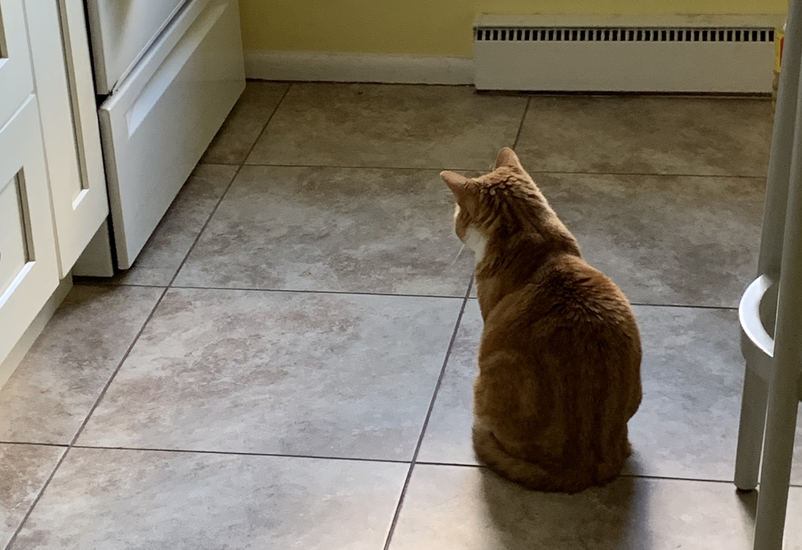

## Day 2 (6/22)

On Day 2, Peach still seemed to be finding her comfort zone, exploring a number of different potential long term hangout spots, including

### Bathtub!

### Carrier!!

### Table!!!

In the end, Peach spent most of her time hanging out on the recently arrived Chewy box, which also happened to contain food for her future consumption!

Once Peach settled in, she largely remained sedentary the rest of the day, refusing to exercise much, sleeping for long periods, and not even bothering to swipe at Jeffrey's Arby's roast beef sandwich at lunch time.

Peach did perk up, however, to a scene from Midnight Diner where the chef was preparing neko manma ("cat rice"):

Those bonito flakes are to die for! Peach must have developed quite an appetite watching the making of cat rice, and gobbled through her Instinct cat food in record time, all before Jeffrey could finish cooking his own oyakodon!

### Day 3 (6/23)

With the overnight rain and drop in temperature, Peach woke up bright and early and started meowing at Jeffrey at 6 am! Jeffrey had been having trouble sleeping the past couple of days and was used to being up at this hour, but Peach was particularly aggressively headbutting Jeffrey while he was still slowly awakening from his slumber.

Peach would have to wait nearly another 1.5 hours before she could eat her meal. Not wanting to eat in front of Peach, Jeffrey also forewent his breakfast until Peach's breakfast robot prepared her meal, precisely at 7:43.

Content with her meal, Peach hopped up to one of her hangout spots and started surveying her kingdom to determine what she wanted to do the rest of the day.

She soon decided that today would be a day of activism. Peach got on her Chewy (soap)box and started complaining to the fellow citizens of the room (Sloopy, Panda Head, and Panda Worm) about how it was unfair she could not have her breakfast when the sun rose. Instead, she had to wait nearly two hours during which she would have to be hungry!

Not wanting the other citizens of the room to get riled up, Jeffrey distracted Peach with a fake fish. Try as he might, however, Jeffrey had a difficult time getting Peach off her soapbox!

<figure class="video_container">
  <video controls="true" allowfullscreen="true" width="50%" >
    <source src="./peach_box_fish.mp4.mov" type="video/mp4">
  </video>
</figure>

Eventually, Peach was only appeased by the arrival of a package. She soon forgot what she was complaining about and started investigating this newfound prize.

Satisfied with the growing collection of boxes, Peach settled down for an afternoon nap.

The rest of the afternoon was largely uneventful. Jeffrey completed his work and cooked up another oyakodon, which he ate undisturbed.

At night, however, Peach seemed to focus her attention towards the lower part of the household stove where all the pots and pans are stored. She spent long periods staring at this area without making a sound or moving a paw. What, if anything, is underneath?

What awaits the duo on Day 4? Will Peach continue her protests? Will Jeffrey's ability to eat in peace finally be disturbed? Will we ever find out what Peach is looking or waiting for underneath the stove!?
