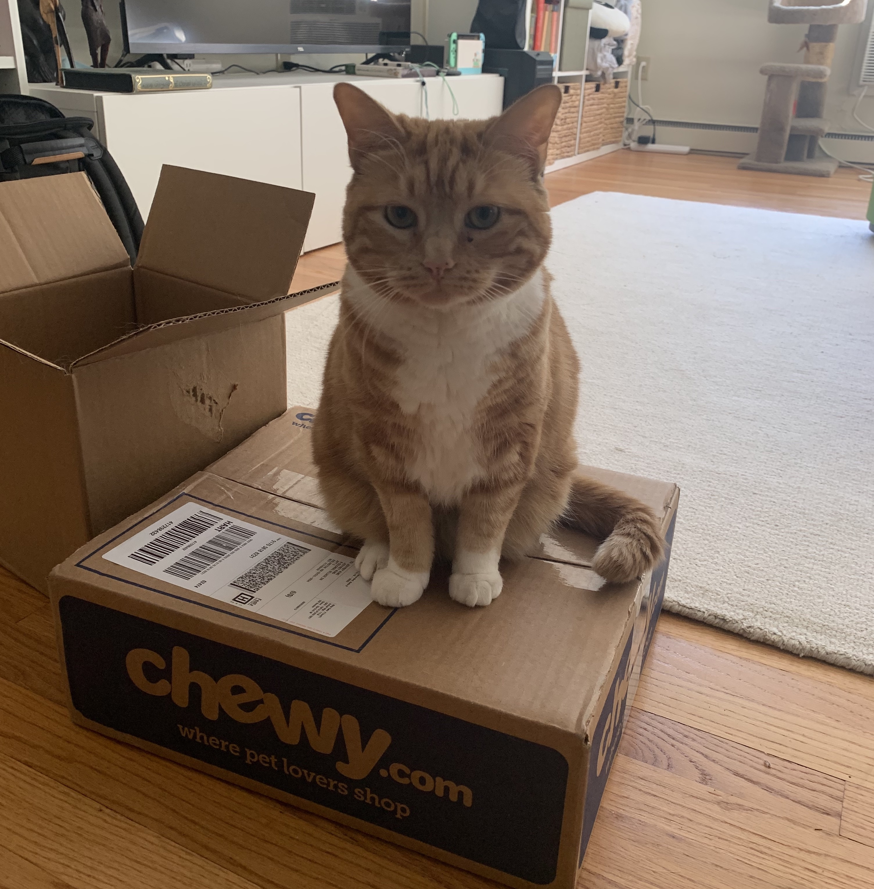
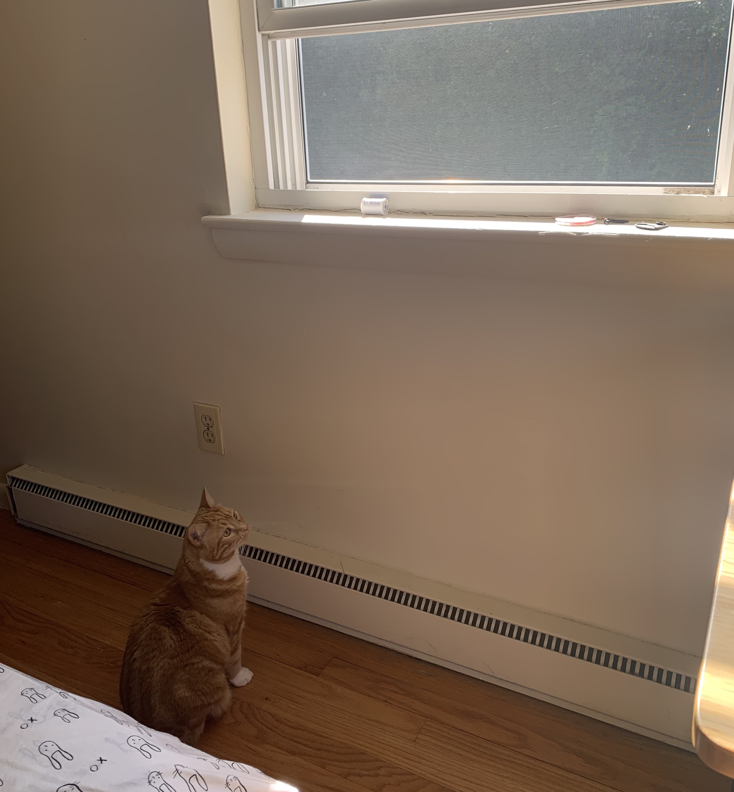
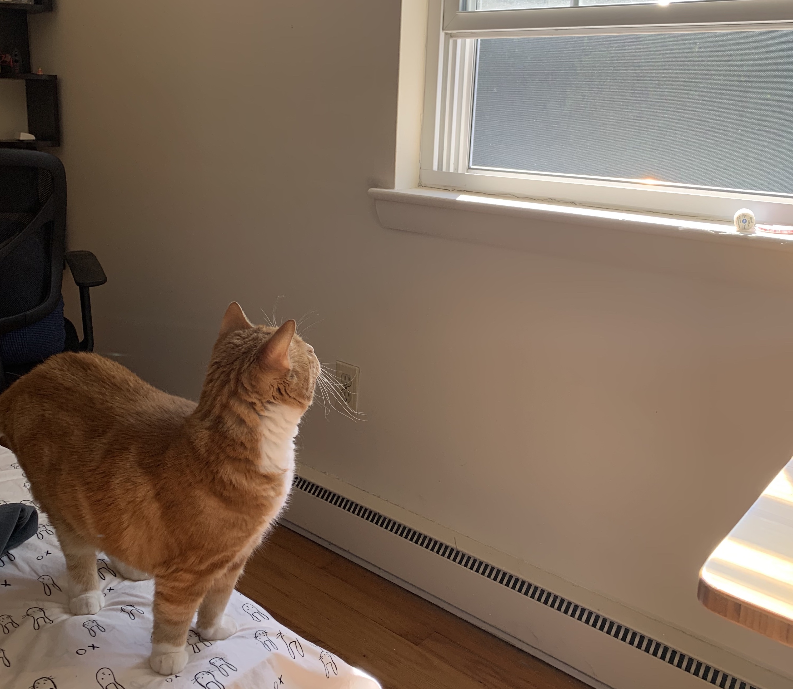
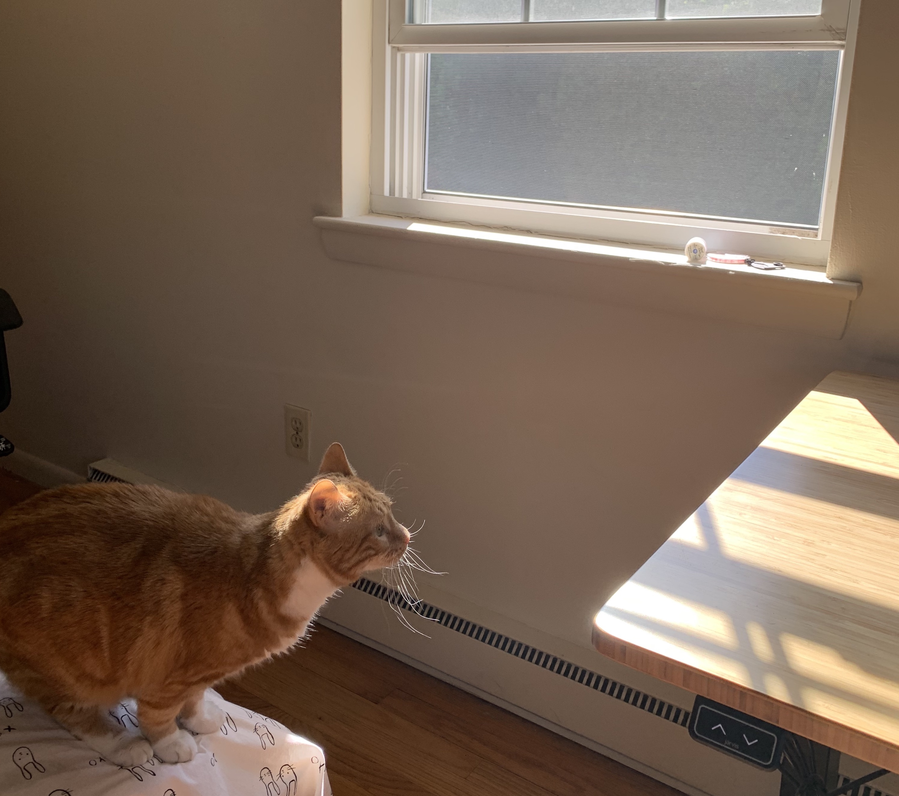
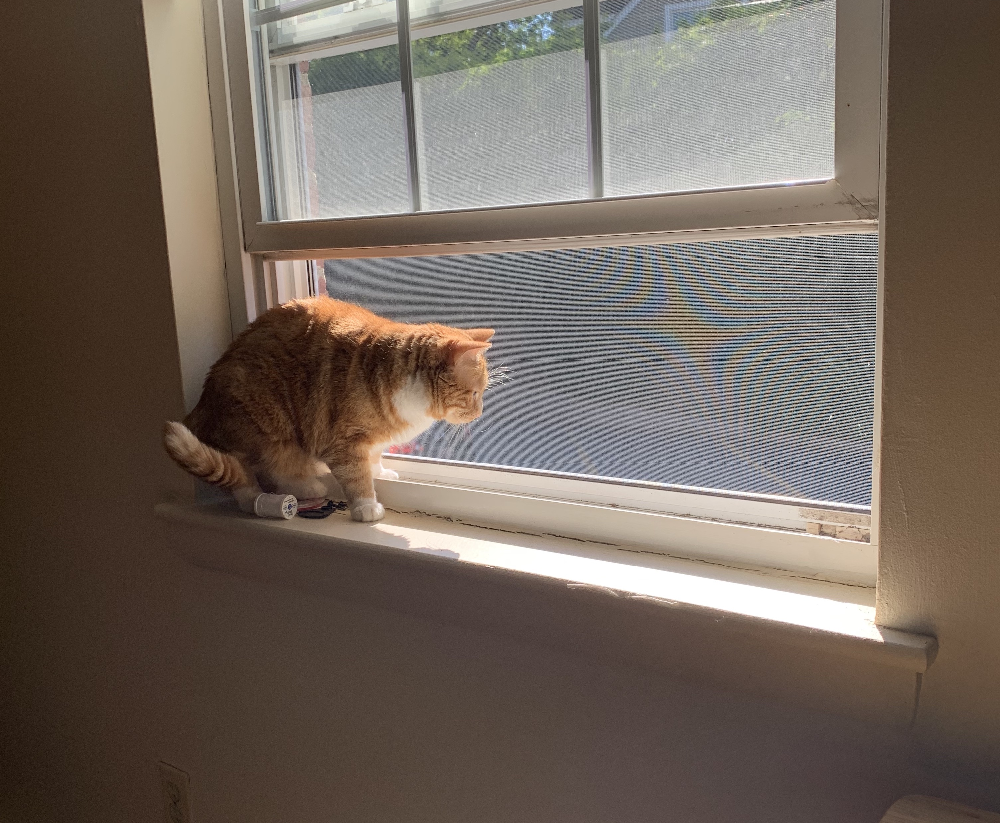
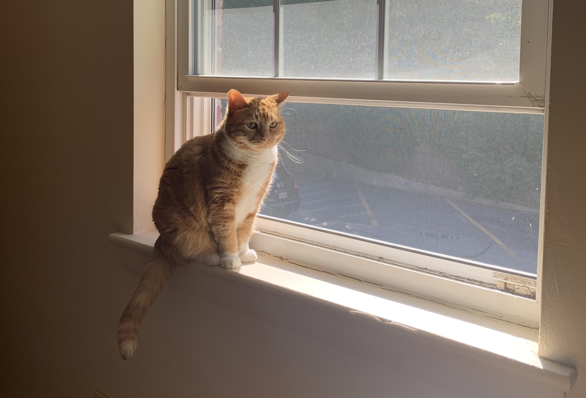

## Day 4 (6/23)

As the sun rose on Day 4, Peach pondered what she wanted to accomplish on Day 4 of her vacation to Colonial Village.

She decided that today would be the day she would jump to new heights. In the previous three days, Peach had been hearing bird chirping noises outside the window, but due to still acclimating to her environment, did not feel ready to investigate. Now feeling more comfortable, Peach wanted to find the source of the noises. At her shorter stature, however, Peach was uncertain whether she could successfully comfortably jump onto the window sill.

She expressed her concern to Jeffrey that there may be unknown objects on the ledge. Jeffrey tried to convince Peach that there was indeed nothing on the ledge, but Peach was unconvinced.

<figure class="video_container">
  <video controls="true" allowfullscreen="true" width="50%" >
    <source src="./peach_searching.mp4.mov" type="video/mp4">
  </video>
</figure>

She decided that she needed to get a better view of the window sill, and hopped onto the nearby bed.

Once on the bed, Peach prepared herself for a daring leap from the bed onto the nearby standing desk where Jeffrey was squashing some bugs.

Would Peach be able to make the jump?

<figure class="video_container">
  <video controls="true" allowfullscreen="true" width="50%" >
    <source src="./peach_jumping.mp4.mov" type="video/mp4">
  </video>
</figure>

Success!

Where the birds at?

Satisfaction

