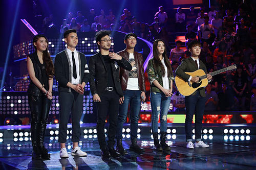
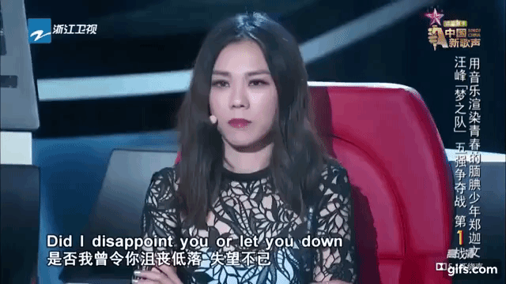
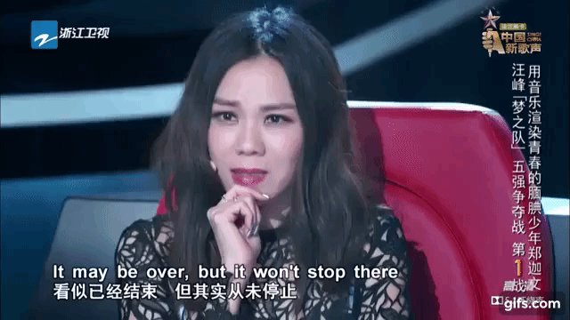

### Team Wang Feng

For a brief overview of the team’s final five, see their group performance of [Jay Chou’s, Snail](https://www.youtube.com/watch?v=gAdpHOijTn4&feature=youtu.be).

Wang Feng teams are generally carried by strong rock performances with splitting vocals ([Zhang Hengyuan](https://www.youtube.com/watch?v=4nAgWvkgSV4&feature=youtu.be), [Bei Bei](https://www.youtube.com/watch?v=yrtL4ahvEZg)). This season was no exception and featured two singers who arguably executed this style better than any of his previous students.

Xu Geyang, who was a fan favorite and likely finalist throughout her run, seemed to improve throughout the show despite not having any technical training and relying heavily on her musical intuition. Her initial performance of [The Red Heart of a Dream Chaser](https://www.youtube.com/watch?v=g0VOr1v43lo) was stellar and one of the most popular performances of the initial rounds. She kicked it up a notch in [Ten Thousand Sadness Level](https://www.youtube.com/watch?v=75E5z_uDHdQ), which despite the name of the song, was an upbeat, hopeful performance that propelled her to potential finalist status.

Liu Wentian, whose high pitched screams and performance intensity carried him to a 7th place finish, just barely missed the finals. Let’s start with the fact that Liu was one of the very few, if not the only contestant whose performance was so thrilling [it compelled Wang Feng to take off a piece of clothing](https://youtu.be/nyPGDCtTyjY?t=219). He was also one of the few pure rock singers that inspired Na Ying to turn in the initial rounds. Going into his second performance, Liu faced two challenges. His first song, [Returning to the Tang Dynasty](https://www.youtube.com/watch?v=nyPGDCtTyjY), was so esoteric that it made it seem like he would be a one hit wonder contestant. The second was that he was singing an iconic Aerosmith song in English, which Wang Feng himself admitted is an incredibly challenging song to perform live. Neither of these ended up being a problem, however. His intensity during his songs, gradual ramping up of emotion during his performances, and tactful mix of high pitched screams, made the listener [not want to miss a thing](https://www.youtube.com/watch?v=_0Iu0tOKrnk). I’m someone who doesn’t typically enjoy hard rock performances, but Liu’s were some of my favorite performances across all music genres.

Traditionally, [males with guitars](https://www.youtube.com/watch?v=hN8xGY76Q6E) have done surprisingly well on this show, particularly in the final rounds. So despite keeping a pretty low profile the first few rounds, Jiang always had a darkhorse vibe. I can’t say I appreciated his performances during my first run through, but after the latest rewatch, I can appreciate the calmness of some of his songs, including, [A Night in Ulaanbaatar](https://www.youtube.com/watch?v=vuqTPEdLl9c).

Zheng Wenjie, whose [sole goal](https://youtu.be/EO02dAepiMI?t=438) in the show was to join Na Ying’s team to meet Na’s good friend, Tanya Chua, ultimately failed to get picked by Na Ying. Wang Feng, being the good bro that he is, however, brought Tanya as his co-judge and Zheng… did. not. disappoint. How good his [performance](https://www.youtube.com/watch?v=eRWgb4tlj18) was in front of his idol is best described through a series of Tanya’s reactions:

American Karen Lam was perhaps the weak link of this team in terms of traditional performance metrics, but she [exceeded her own early expectations](https://youtu.be/y1A0SIWfxHo?t=5035) and her [ghostly performances](https://www.youtube.com/watch?v=oiOjcadCGCM) added some much needed variety to what we typically see from the show.

With a team of two of the best rock singers in the show’s history, the eventual winner, and two additional singers each with memorable performances, this was easily Wang Feng’s best team in his tenure on the show. Perhaps this speaks more to his historically weak teams. On the other hand, this also was the first season where Wang Feng showed he had a sense of humor and signs of a personality (more on this later). A coincidence? Likely not.
