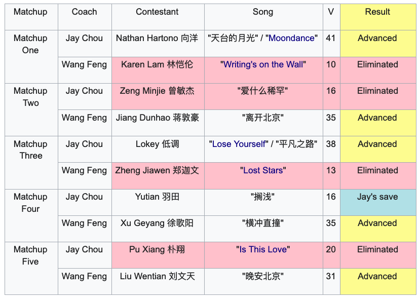

<iframe width="560" height="315" src="https://www.youtube.com/embed/A6IekM3JG1E?start=3154" frameborder="0" allow="accelerometer; autoplay; encrypted-media; gyroscope; picture-in-picture" allowfullscreen></iframe>

Four years after the initial airing of the show, it’s still fun to analyze what could have happened if things had gone slightly differently in the teacher inter-team battle rounds. That’s a testament to the format and quality of the season five performances. Below is how the contestants from each team eventually matched up and the results.

There are many angles of analysis, but let’s start with the information we know from the show. It’s difficult to deduce each judge’s strategy going into the contest, as after each round, the judge has an opportunity to adjust their strategy based on the previous performance. But it’s likely that each judge had thought through who they wanted to compete first. Jay choosing Nathan to lead off seems to suggest he wants a strong start. Despite an overly histrionic second performance that drew some criticism from judges, Nathan still was in contention for the finals at this point.

Wang Feng seems to take the opposite approach here, inserting Karen, one of his weaker team members, perhaps to test the waters. If Jay sends out one of his stronger candidates, it’s not that big of a loss. If he sends out Zeng, she has a shot, and against Yu, she also has a puncher’s chance

It’s interesting that Na Ying predicted Wang Feng would send out Xu Geyang as she reasoned he’d send out someone who could really work up the crowd. This was true in his first team competition round when he sent out Ari to perform “Beat It / Let’s Move Together”. If the matchup had happened, I’d still give the edge to Xu, but it would have been fairly close and might have resulted in one of the judges using their saves early.

Wang Feng correctly predicts Jay’s next two opponents. As a result, we can attempt to analyze why Wang Feng made the choices he did, though we’ll never actually know if he made his choices based on what he predicted or if there were other more important factors that played a role in what he ultimately decided.

Choosing Jiang Dunhao to go against Zeng Minjie in round two is interesting because this seems like a reasonably even matchup. Neither Jiang or Zeng are overpowering, but each have unique aspects to their singing that set them apart. And while Jiang was the eventual winner of the entire season, at this stage, he never really felt like he was a true frontrunner even heading into the finals. Had he gone up against Pu Xiang or Lokey, it’s possible he would not have made it past this round. So perhaps Wang took a chance here at a more even matchup, hoping his contestant would pull through. The other path he could have taken here is to choose Xu Geyang or Liu Wentian to increase the chances that one of them got through.

In the third round, Wang Feng chose Zheng Jiawen to battle Lokey. At this stage, Lokey was a frontrunner group with two solid and popular performances ([My Sky](https://www.youtube.com/watch?v=gR-QRXO1fFU) and [Bad](https://www.youtube.com/watch?v=7aJO3PdF_3U)). Wang possibly didn’t want to put one of his two favorites, Xu Geyang and Liu Wentian against Lokey because there’d be a reasonable chance that either would lose. Though Pu Xiang still remained as a fierce competitor, with this approach, at least one of them would have a good chance of making it through. Zheng also had an outside shot as his second performance was fantastic ([Goodbye My Lover](https://www.youtube.com/watch?v=eRWgb4tlj18)), so perhaps this was a calculated gamble by Wang Feng - a likely loss with a small chance of upset.

In the fourth round, Wang incorrectly predicted that Jay would send out Pu Xiang, but despite being wrong, he intentionally chose Xu Geyang to go against Pu, which would have been quite the battle as both of these were frontrunners at this point. There are a couple of reasons he might have taken this approach. One possibility is that Wang didn’t think Liu could defeat Pu, but believed that Xu had a chance. Between these two matchups, he felt this gave him the best overall chance of getting both members through.

Another possibility is that Wang thought Xu was his best chance in the finals and wanted to guarantee she got through. In the case that Xu lost this round, he could use his save on her and give her a second chance. If Xu won, he would still have his save for Liu Wentian. With this approach, he wouldn’t risk missing out on using a save on at least one of his top team members.

If Wang had ordered his Xu and Liu differently, he might have ended up in Jay’s situation. Jay was forced to use his save on Yu Tian, which in a vacuum is reasonable, but as a result of his decision, he was not able to use it on Pu in the last round , which was questionable. Pu was immensely popular with support from both viewers and judges and had real championship potential. This all of course is assuming that the judges agree with prioritizing Xu Geyang over Liu Wentian and Pu Xiang over Yu Tian.
