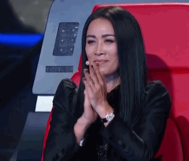
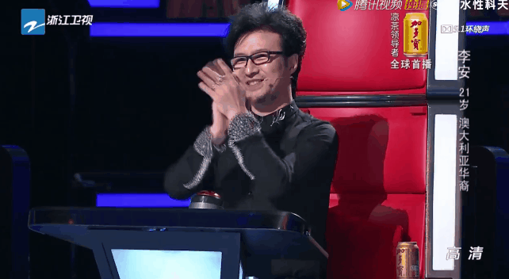
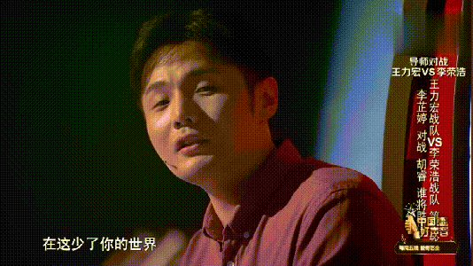
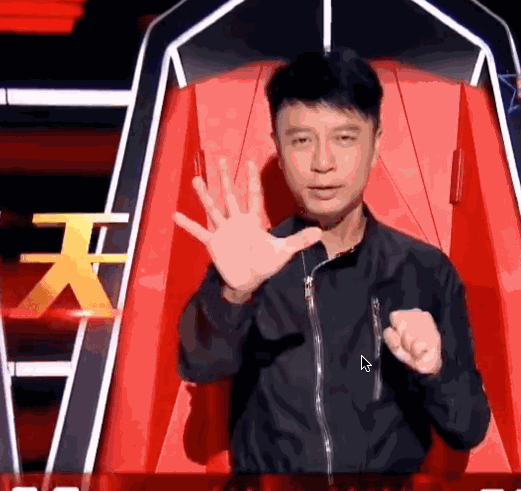

In the first episode of Voice of China (VOC) season ten, the [judge performances](https://youtu.be/tnsCWtmhGq0?t=489) paid homage to previous performances from past seasons, including those by Jay Chou, Nick, Li Jian, and Liu Huan. The tribute was a nice gesture considering it'd be impossible to bring back everyone's favorite judges. The producers, however, likely still put heavy consideration into who to bring back for this celebratory season ten. How well did they do? Here's a semi-serious, mostly facetious analysis of how the producers did with their judge selection.

### Sister Na

The only must have judge for season ten, Sister Na has participated in six of the show's ten seasons, winning three of them. After [rumored discontent](https://www.straitstimes.com/lifestyle/entertainment/na-ying-quits-as-sing-china-mentor) between Na and the show's producers, Na's return was far from guaranteed. The producers, however, seem to have either made amends or paid a salary so extravagant that Na could not resist. Whatever the process, it was the right and necessary move. 

Na's history and success on the show speaks for itself. She's often the central character of many of the judges' interactions, and has consistently been great on the show, both in terms of banter, gif producing moments, and coaching.

A perfect choice. 

#### Rating: A+

### Wang Feng

Coach for four seasons (2,3,4, and 5) and a one time winner (with Jiang Dunhao), Wang Feng has been the second longest tenured coach for VOC. Wang Feng's time has completely overlapped with Sister Na's, and the rapport they developed during their four years will likely bring back the lively banter that's been absent in the past few seasons. Throughout their time, Wang has served as the perfect foil to Na - rock vs ballad, stoic vs excitable, boy vs girl, single time winner vs multiyear winner - the list goes on and on. 

Great choice! 

#### Rating: A

### Li RongHao

The difficulty in finding a VOC gif with only Li RongHao bodes poorly for the selection, but the two time judge and one time winner (Xing Hanming) is the only judge who has been on the show for the previous two seasons. This continuity cannot be overlooked despite Li never having been one of the more vocal coaches during the competition. It'll be interesting to see how well he meshes with the two old heads of Na and Wang. His return also certainly guarantees the return of more small eye jokes from his fellow judges. Maybe these jokes actually poll well with the Chinese audience?! 

With the introduction of original song performances from last season, Li also is a good choice given his experience in composing. Li checks off all the practical boxes, though it's difficult to be too enthusiastic about his return when compared to some of the other judges who have been on the show (like the other judge in the gif).

Fine choice.

#### Rating: B

### Hacken Lee

It's a bit puzzling that the production team wasn't able to bring back all former judges for the tenth season, but perhaps they tried and failed, or they actually wanted to bring a fresh face to the scene. Most of the more recent versions of VOC have featured at least one Cantonese singer (Nick or Eason), so Hacken fits a need here. His consistency across over four decades and recent appearance on [I Am a Singer](https://www.youtube.com/watch?v=NHdfUckpyL8) has likely buoyed his popularity and will draw a certain audience. 

Also unlike co-judge Wang Feng, who has been plagued by rumors of infidelity, Hacken's reputation is clean as a whistle. A fresh judge also gives Wang and Na a target for bullying, but it's hard to imagine being successful bullying a guy as clean cut as Hacken.

Solid choice. 

#### Rating: B+

### Overall Rating: A-

Sister Na with any combination of previous judges likely already baselines the rating at B, but the addition of long time VOC buddy, Wang Feng, pushes the team to B+/A- territory. Li and Hacken will both be fine, with Hacken's experience as host of I Am a Singer potentially bringing significant upside for the group banter. 

An A+ team likely would have been Na, Wang, Jay Chou, and Harlem harkening back to the glory days of Season 4 and 5. An equally good one might have been three of the above with the addition of Season 2 winner and the [ultimate party girl](https://www.youtube.com/watch?v=NFHb0OwmE-0), A-mei. But alas, looks like we'll need to wait until season 11 to see a judging cast that is at least 50% women. 
