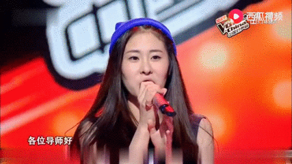
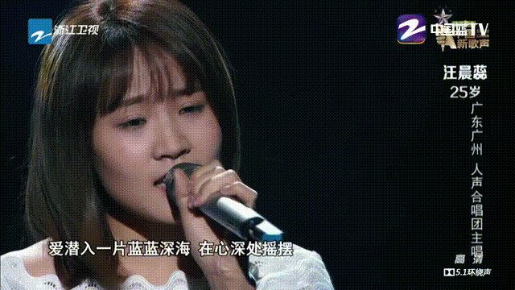

For the first time, each judge on the Voice of China (VOC) has a helper buddy. It's unclear how much agency each judge had in selecting their buddy, but regardless of who ultimately made the final decision, we'll analyze the quality of the selection and propose a few alternate buddies that may have also been considered. 

Our criteria for good buddy selection (in no particular order) include:

1. Individual performances on VOC
1. Background story
1. Personality fit with judge
1. Personality on the show
1. Diverse musical or cultural background
1. Overall performance (how far did they make it?)
1. Trajectory after VOC 

For alternates, we will only consider previous female competitors as all the buddies ended up being women. 

Today we start with Sister Na's buddy...

### Diamond Zhang

Watch the buddy intro [here](http://www.zjstv.com/zcloud/video/8999434.html).

Much like Na Ying was a no brainer to return as judge for the tenth season, Diamond was the clear cut choice to be Sister Na's buddy judge. Her performance "She speaks" (below) likely ranks as one of the best trial performances in the history of the show. 

<iframe width="560" height="315" src="https://www.youtube.com/embed/eF8qG-igcsA" title="YouTube video player" frameborder="0" allow="accelerometer; autoplay; clipboard-write; encrypted-media; gyroscope; picture-in-picture" allowfullscreen></iframe>

In the above performance, notice ballad singer and judge, Qi Qin, pop out of his chair (1:31). On VOC in general, One of the biggest compliments a ballad contestant can receive is to compel Wang "Mr. Rock and Roll" Feng to turn around (3:35). (Side note: why does Yang Kun always look so creepy (see 2:20)? Great decision not to bring him back.)

Her background story is also solid and likely relatable to many music lovers in China. Young girl has dreams of becoming singer, disregards her parents' dream of her living the 4 years of college 2 years of grad school life and sets out on her own to a foreign land to make a name of herself. Now coming back home, she's ready to prove to her parents her decision was justified.

Let's also give credit to Zhang for delivering some song diversity to the show, singing what might be the only performance that used three separate languages (Korean, English, Mandarin).

<iframe width="560" height="315" src="https://www.youtube.com/embed/hJt1CVdWiqk" title="YouTube video player" frameborder="0" allow="accelerometer; autoplay; clipboard-write; encrypted-media; gyroscope; picture-in-picture" allowfullscreen></iframe>

Besides just being an individual star, Zhang headlined a killer final four team in Season 3 for Na Ying, which together had one of the best choreographed team dance performances in the show's history. Her final round against teammate Chen Bing might as well have been the finale as Chen certainly could have made a claim for being the second best contestant of the season. 

<iframe width="560" height="315" src="https://www.youtube.com/embed/SR4dyiyBX6s" title="YouTube video player" frameborder="0" allow="accelerometer; autoplay; clipboard-write; encrypted-media; gyroscope; picture-in-picture" allowfullscreen></iframe>

All of this alone would be enough to justify bringing Diamond back as buddy judge, but Diamond has also translated her VOC success to become the singer of many TV dramas and to participate in shows designed more experienced singers ([歌手](https://www.youtube.com/watch?v=PI_7jugRQ00)). 

#### Rating: A+ 

### Alternate contenders

#### Chen Bing

The girl who never turns had the misfortune of participating in the same year as Diamond, but her performances were equally striking due to her fierce screaming style that still felt comfortable on the ears. Her rousing audition and rendition of "Summer Light Year" compelled all four judges to give a standing ovation. 

<iframe width="560" height="315" src="https://www.youtube.com/embed/Ex9OfoMenbM" title="YouTube video player" frameborder="0" allow="accelerometer; autoplay; clipboard-write; encrypted-media; gyroscope; picture-in-picture" allowfullscreen></iframe>

Chen's story also likely resonates with many musicians. Parents want kid to go into finance, but kid wants to pursue music. Parent breaks kid's instrument, but kid rebels and goes to college for music. After graduation, kid realizes there are few opportunities to pursue music and finds a normal job at a financial organization. But ultimately, nothing can hold back her simple dreams of becoming a singer and she's here on VOC to prove her salt. 

Chen's post VOC career has seemingly been less successful. She seems to have produced an album or two, but never saw much more success afterwards. Perhaps her closest claim to fame was defeating fellow contestant [Eve Ai](https://www.youtube.com/watch?v=PXmGrkEtxrc), who in contrast has become one of the more successful alumni of the program, in the [battle round](https://www.youtube.com/watch?v=7mhUiCe5BFM). 

#### Wang Chenrui

Third place overall finisher in Season 5, Wang does not have one standout performance like Zhang or Chen, but she was a singer who progressively improved throughout the season, closing out with a 3rd place finish in the final after placing 9th . Her rendition of Eason's ["Love moves"](https://www.youtube.com/watch?v=N4zFIUKP_Ek) and Joker's ["What else ya want me to do?"](https://www.youtube.com/watch?v=w8g7MGUvg40) are both stellar performances, especially the former where she seamlessly connects the Mandarin version directly into the Canto version. She also is one of the few representatives on the show with an A capella background, further adding to her diverse musical background. 

Like Chen, Wang does not seem to have had much post-VOC success, but she did return to the show one season to support her fellow A capella teammate. 

#### Jisashama Shaqima

What happened to her?! Wouldn't it be great if they brought her back as judge and explained why she was inexplicably kicked off the show despite being an immediate frontrunner after her [first performance](https://www.youtube.com/watch?v=7h6m3cDnkgM?)? Maybe they did not want Sister Na to win a fourth title. Maybe their kicking her off was the reason she quit again after this season. Will we ever find out? 

#### Honorable Mentions 

* Jeryl Lee - ["I know you feel real bad"](https://www.youtube.com/watch?v=bvILj-rfuSw)
* Double Xuan - [“Am I or am I not the person you love the most"](https://www.youtube.com/watch?v=x-pb5MEqFcM)